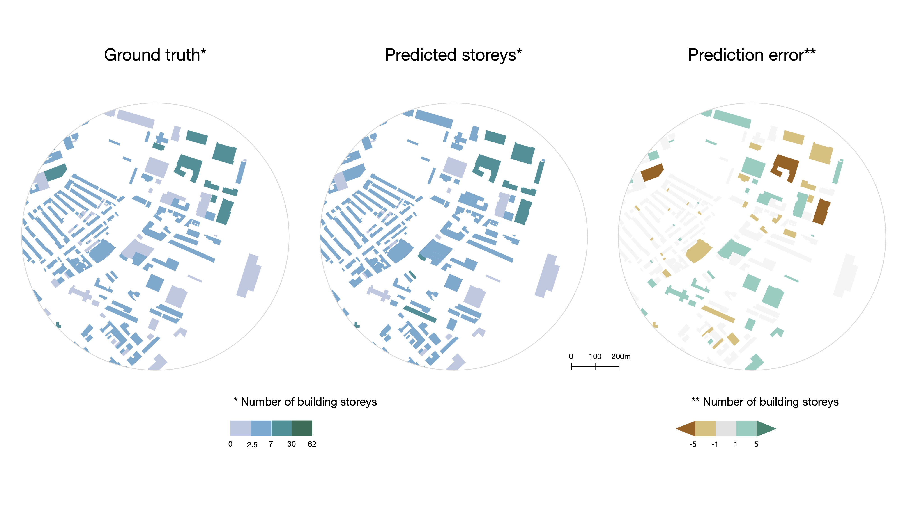
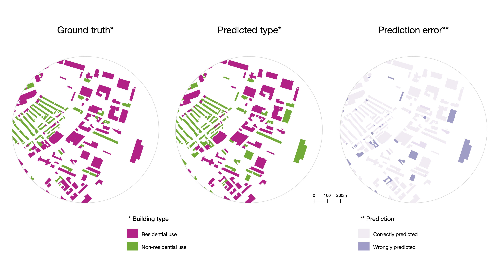

# Predicting building characteristics using graph neural networks and street-level contexts

## Introduction

Building characteristics, such as storeys and types, play an important role across a multitude of domain. However, geospatial data on the building stock is often fragmented and incomplete.

Here, we propose a novel method to predict a set of building characteristics within diverse contexts, addressing the existing data gaps. Our method exploits the geospatial connectivity between street-level contexts and building stocks, employing Graph Neural Networks (GNNs) for modelling spatial patterns to infer multiple building characteristics.

<!-- ## Data

Two types of data are considered for designing our method:

- Building data from open government datasets
- Street-level contexts from [OpenStreetMap](https://www.openstreetmap.org/), using [Overpass](https://overpass-turbo.eu/) -->


## Sample dataset

For demonstration, we provide a [`sample_data.csv`](https://github.com/binyulei/gnn-building-characteristics-prediction/blob/c5e0c18e87b2c2309e64b97f8818d4af372b138a/sample_data/sample_data.csv) in Boston for running this notebook. This include:

- [Building data in Boston](https://data.boston.gov/dataset/boston-buildings-inventory)
- Street-level urban objects, obtained from [OSM](https://www.openstreetmap.org/#map=12/42.3125/-70.9979). Here is an example to retrieve the spatial distribution of points of interests via [Overpass API](https://overpass-turbo.eu/):


```shell
[out:json];
{{geocodeArea:Boston}}->.searchArea;
// gather results
(
  // query part for: amenity=*”
  node["amenity"](area.searchArea);
  way["amenity"](area.searchArea);
  relation["amenity"](area.searchArea);
);
// print results
out body;
>;
out skel qt;
```

## Method

We are using graph neural networks (GNNs) to model the spatial connectivity between buildings and their surrounding urban objects at street scale. Therefore, such spatial instrcutrue can be exploited to infer building characterstics.

To aggregate street-level contexts, we map urban objects around a building of interest within three scales - 50m, 200m and 500m.

To infer multiple building characteristics across cities, we use our Graph-based method [`gnn_building_prediction.ipynb`](https://github.com/binyulei/gnn-building-characteristics-prediction/blob/0897d90d57b3fbd05bef5e96154208a94bda5ec9/gnn_building_prediction.ipynb) to train and evaluate the predictions.


## Expected results

1. Compare predicted building storeys and ground truth in Boston
<div align=center>

</div>

2. Compare predicted building type and ground truth in Boston
<div align=center>

</div>

## License

It is licensed under the terms of the MIT license.

